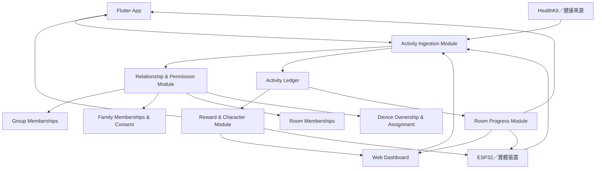
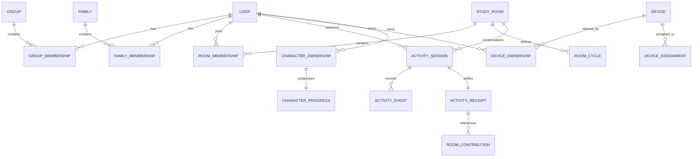
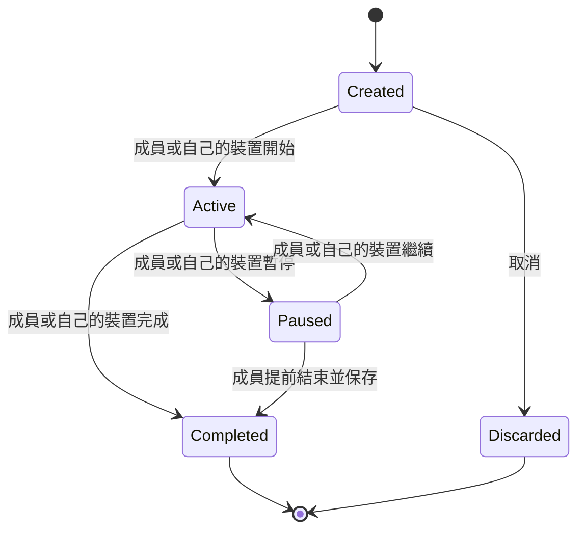
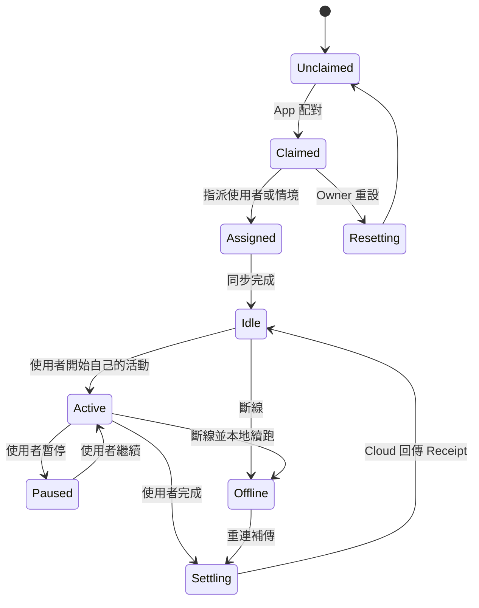

# Nudge 全系統與多活動自律房藍圖

- Status: Working blueprint
- Date: 2026-07-28
- Scope: App、Web Dashboard、Cloud、角色養成、團體、家庭與實體裝置

## 1. 目標

Nudge 的核心不是由管理者主持活動，而是讓使用者在可選擇的同儕環境中，
自行開始、自行完成並對自己的資料負責。自律房提供活動主題、共同規則、
共同目標與同儕回饋；房主不控制其他成員的活動生命週期。

本藍圖的目標是讓以下能力使用同一份領域模型與資料真相：

- 使用者可建立專注、健身、運動、步數、睡眠或自訂活動的自律房。
- 每位成員獨立進行活動，同一房間不需要全員同時開始或結束。
- App、Web、HealthKit 與實體裝置可提交活動資料。
- Cloud 統一驗證身分、來源、重複事件、房間貢獻及獎勵。
- 團體管理者、一般成員、家長與孩子看到不同介面與權限。
- 個人角色進化、房間共同成果、團體成果與家庭成果彼此有關，但不互相冒充。

## 2. 現況基線

目前已存在：

- `StudyRoomType.study / sleep / exercise / steps / custom`。
- 專注與自訂房由當前使用者自行開始、暫停及完成計時。
- 睡眠、運動與步數房可使用健康資料同步進度。
- 房間成員、加入審核、聊天、貼圖、事件、個人目標與共同進度。
- App 與 Web 共用 Firestore 的部分使用者、團體及角色資料。
- 完整三階角色系列、初始階商城規則與角色圖鑑。
- App 與 Web 會以目前有效的 `family_links` 與 `groups` 文件判定家長、孩子、
  團體管理者及成員；個人檔案中的舊角色值只作為尚未綁定時的入口意圖。
- 家庭與團體能力可以同時存在，例如孩子也可以是團體成員；團體身分不會
  取代個人的自律工具。
- 團體挑戰具有唯一版本識別與成員自己的參與文件；App 與 Web 顯示相同的
  加入、逐日任務進度及清單完成狀態，管理者不能替成員參加或填寫進度。
  此狀態不直接發放個人 XP／自律幣，也不等同尚待 Activity Receipt 結算的
  正式團體成果。
- Cloud 已提供具 App Check、身分綁定、來源去重、交易式 Receipt 與
  Room Contribution 的正式 Activity Ledger callable。
- App 的個人專注與自律房活動已使用耐久 outbox 提交 Ledger；離線或暫時性
  失敗不會遺失事件，也不會在 Cloud 確認前由端點自行發獎勵。
- Health Connect／Apple Health 已轉換為每日步數、睡眠、運動快照，經
  provider 分批送入 Cloud；同日後續快照建立不可變 correction Receipt，
  不覆寫舊 Receipt。

尚未完成或仍需重構：

- ESP32 韌體、BLE 配對、Wi-Fi 同步、裝置事件及裝置模擬器。
- 多團體成員關係與關係範圍角色。
- 正式家庭與家庭成員關係。
- 所有 App 與 Web 頁面共用的完整細粒度權限判斷。
- Web Dashboard 仍需改走 Activity Ledger，App 內舊健康／房間投影也仍需
  在讀取端切換完成後移除。
- 房間資料與使用者文件中既有投影資料的遷移、封存與清除。

## 3. 核心產品原則

### 3.1 個人自主

成員或其指派裝置控制自己的活動。房主、團體管理者與家長不能遠端開始、
暫停、結束或修改另一位成員的活動。

### 3.2 房間長期存在

自律房是長期同儕空間，不是一次性的主持場次。房間可以包含每日、每週或
期間型目標週期，但週期結束不等於房間結束。

### 3.3 一筆行動，一次個人獎勵

同一筆步數、睡眠、運動或專注紀錄可以對多個已授權房間顯示貢獻，但只能
產生一次個人 XP、自律幣及角色經驗。

### 3.4 關係提供情境，不取得控制權

團體管理者可以建立官方房間，家長可以提出共同目標；成員與孩子仍保有
是否加入、是否分享及是否執行的決定權。

### 3.5 角色是回饋，不是權限

夥伴角色呈現努力、陪伴與成長。角色、造型或進化階段不授予管理權限，
也不提供付費數值優勢。

### 3.6 Cloud 是活動與獎勵真相

App、HealthKit、Web 與裝置都是活動來源 Adapter。Cloud 統一驗證、
去重、記帳及計算房間貢獻；任何單一端點都不能自行鑄造獎勵。

### 3.7 關係角色以有效連結為準

登入後的家長／孩子及管理者／成員身分，必須由目前有效的家庭連結與團體
成員資料推導。使用者個人檔案中的角色選項不能覆蓋已建立的正式關係。
家庭與團體是可組合能力，不是互斥帳號類型；介面可以選一個主要情境，
但仍須保留使用者在其他有效關係中的入口與權限。

## 4. 總體架構



### 4.1 關鍵 Module 與 Interface

#### Activity Ingestion Module

所有活動來源只需要學會提交活動證據：

```text
recordActivity(ActivityEvidence) -> ActivityReceipt
```

Module 內部負責：

- 驗證提交者與來源。
- 驗證房間及成員關係。
- 去除重複事件。
- 處理離線補傳。
- 建立或更新 Activity Session。
- 產生唯一 Activity Receipt。
- 計算可見房間貢獻。
- 保證個人獎勵只發一次。

#### Relationship & Permission Module

所有端點透過同一個 Interface 取得能力：

```text
resolveCapabilities(actorId, context) -> CapabilitySet
```

App 與 Web 不得自行從 `userRole` 猜測權限。

#### Device Sync Module

Cloud 與裝置使用 desired/reported state：

```text
setDesiredState(deviceId, command) -> CommandReceipt
reportDeviceState(deviceId, state) -> DeviceReceipt
```

裝置不能直接寫入角色階段、幣值或房間排名。

## 5. 領域關係



## 6. 自律房正式模型

### 6.1 Study Room

一個長期存在、只聚焦一種活動類型的同儕自律空間。

主要資料：

- `roomId`
- `name`
- `activityType`
- `progressMode`
- `visibility`
- `joinMode`
- `ownerId`
- `rules`
- `dailyGoal`
- `weeklyGoal`
- `memberLimit`
- `status`: `active | paused | archived`
- `createdAt`
- `updatedAt`

### 6.2 Room Membership

使用者與房間的關係：

- `membershipId`
- `roomIds`：活動本身不隸屬單一房間，可為零到多個候選房間；實際計入仍由
  Room Contribution 與發生時的 Membership／分享同意判定
- `userId`
- `role`: `owner | moderator | member`
- `status`: `pending | active | muted | removed | left`
- `joinedAt`
- `sharingPolicy`
- `personalGoal`

Room Membership 角色只影響房間設定與管理，不影響活動控制權。

### 6.3 Room Cycle

房間中的一段共同目標期間：

- 每日挑戰
- 每週共同進度
- 連續 30 日活動
- 特定日期的團體活動

週期可為 `scheduled | active | settled | cancelled`，但房間仍可維持
`active`。取消週期不能刪除已驗證的個人活動。

### 6.4 Activity Session

一位成員的一次活動：

- `activitySessionId`
- `activityCorrelationId`：Cloud 發行的跨 App／裝置／健康來源關聯 Token
- `actorUserId`
- `roomId`
- `activityType`
- `source`
- `sourceDeviceId`
- `status`: `active | paused | completed | discarded`
- `startedAt`
- `endedAt`
- `metricValue`
- `metricUnit`
- `evidenceRef`

只有 `actorUserId`、其已指派裝置或受信任健康 Adapter 可以改變活動狀態。
`metricSynced` 會建立可稽核的 Receipt 與房間貢獻，但 Session 保持
`active`，且不具個人獎勵或角色經驗資格；只有經規則確認的 `completed`
事件可以結束 Session 並進入獎勵判定。

### 6.5 Activity Receipt

Cloud 對活動的唯一驗證結果：

- `receiptId`
- `activitySessionId`
- `actorUserId`
- `activityFingerprint`
- `acceptedMetric`
- `rewardEligible`
- `rewardIssued`：只有 Cloud 已在同一交易建立正式獎勵 Ledger 時才可為 `true`
- `characterExperienceEligible`
- `characterExperienceIssued`：只有 Cloud 已在同一交易建立角色經驗 Ledger
  時才可為 `true`
- `verifiedAt`
- `correctionOfReceiptId`

Room Contribution 只能引用 Receipt，不得自行建立個人獎勵。

## 7. 四種進度模式

### 7.1 計時型

適用：

- 共讀
- 專注
- 冥想
- 部分健身與自訂活動

流程：



房主不能操作以上轉移。

### 7.2 健康同步型

適用：

- 步數
- 睡眠
- 運動分鐘
- 距離

特性：

- 不顯示全房開始或結束按鈕。
- 顯示同步來源、最後同步時間與權限狀態。
- HealthKit 或受信任穿戴 Adapter 提交增量或更正。
- 使用者可以手動要求同步，但不能自行輸入受保護的健康數值。
- 原始健康資料不向房主、團體或家庭成員公開。

### 7.3 打卡型

適用：

- 喝水
- 伸展
- 整理桌面
- 閱讀一章
- 自訂日常習慣

特性：

- 使用者自行確認完成。
- 房間可設定每日上限與冷卻時間。
- 高價值獎勵不得只依無證據打卡發放。
- 可選擇要求照片或裝置證據，但必須事前說明與同意。

### 7.4 裝置感測型

適用：

- 在席提醒
- 實體按鍵啟動的專注
- 環境光或距離狀態
- 未來核准的運動感測

特性：

- 感測器只能提供 Activity Evidence。
- 「在座位」不能直接等於「專注完成」。
- 裝置離線時保存事件，重連後按事件順序補傳。
- Cloud 驗證裝置指派、事件簽章、時間與重複狀態。

## 8. 房主、團體、家庭與個人權限

| 行為 | 房主 | 團體管理者 | 一般成員 | 家長 | 孩子 |
|---|---:|---:|---:|---:|---:|
| 建立個人活動 | 僅自己 | 僅自己 | 僅自己 | 僅自己 | 僅自己 |
| 暫停／結束別人的活動 | 否 | 否 | 否 | 否 | 否 |
| 設定房間規則 | 是 | 官方團體房可 | 否 | 家庭房需共同同意 | 家庭房需共同同意 |
| 審核加入 | 是 | 官方團體房可 | 否 | 否 | 否 |
| 移除不當成員 | 是 | 官方團體房可 | 否 | 否 | 否 |
| 查看個人原始健康資料 | 否 | 否 | 僅自己 | 依孩子逐項同意 | 僅自己 |
| 建立共同目標 | 是 | 是 | 可提案 | 可提案 | 可同意或拒絕 |
| 強制加入房間 | 否 | 可派發邀請，不可代接受 | 否 | 否 | 否 |
| 控制個人裝置 | 僅自己的裝置 | 僅團體擁有裝置 | 僅自己的裝置 | 僅自己的裝置 | 僅自己的裝置 |

## 9. App、Web、Cloud、Device 分工

### 9.1 App

- 探索、建立及加入自律房。
- 選擇目前房間與個人目標。
- 開始、暫停、完成自己的計時型活動。
- 觸發 HealthKit 同步。
- 完成打卡及查看證據要求。
- 配對與指派個人裝置。
- 同意家庭、團體及資料分享請求。
- 查看角色即時成長、同儕鼓勵與房間成果。

每種房型只顯示一個主要行動：

| 進度模式 | 主要行動 |
|---|---|
| 計時型 | 開始我的活動 |
| 健康同步型 | 同步我的進度 |
| 打卡型 | 完成今天的打卡 |
| 裝置感測型 | 連接或查看我的裝置 |

### 9.2 Web Dashboard

一般成員：

- 長期個人趨勢。
- 多房間貢獻比較。
- 房間週期與回顧。
- 資料來源與分享設定。

房主／Moderator：

- 房間設定、規則、加入審核及內容管理。
- 共同週期、公告及房間聚合報表。
- 只能查看成員允許的聚合資料。

團體管理者：

- 建立官方團體房與邀請。
- 成員與管理角色設定。
- 團體行事曆、房間摘要及團體擁有裝置。
- 不能遠端操作成員個人活動與裝置。

家長：

- 提出家庭目標、送鼓勵及查看獲准摘要。
- 不能代替孩子加入、開始或完成活動。

### 9.3 Cloud

- 身分驗證與 Capability 解析。
- 關係、房間、裝置及資料分享授權。
- Activity Evidence 驗證。
- 去重、補傳、修正及 Activity Receipt。
- 個人獎勵、角色經驗與房間貢獻計算。
- desired/reported device state。
- 稽核紀錄、通知與安全規則。

### 9.4 ESP32／實體裝置

第一版個人專注裝置：

- OLED：目前房間、個人目標、剩餘時間與角色快照。
- LED：準備、活動、暫停、休息、完成、離線。
- 按鍵／旋鈕：選擇房間、開始自己的活動、暫停、繼續、完成。
- BLE：配對、初始 Wi-Fi 設定與近端控制。
- Wi-Fi：Cloud 同步與離線事件補傳。
- 本地儲存：未確認 Activity Events 與最後角色快照。

裝置不提供：

- 開始或結束整間房。
- 操作其他成員裝置。
- 改變房間規則。
- 修改角色擁有、進化階段或幣值。
- 顯示未授權的健康原始資料。

團體共用裝置只顯示聚合狀態、公告、簽到與共同成果，不控制個人裝置。

## 10. 裝置擁有與指派

### 10.1 Device Ownership

決定誰可以：

- Claim 或解除 Claim。
- 重設裝置。
- 移轉所有權。
- 管理韌體政策。

Owner Scope：

- `user`
- `family`
- `group`

### 10.2 Device Assignment

決定裝置目前服務誰：

- `assignedUserId`
- `assignedContextType`: `personal | room | family | group`
- `assignedContextId`
- `validFrom`
- `validUntil`
- `status`

家庭或團體擁有裝置仍必須知道目前 Actor。Owner 不等於目前使用者。

### 10.3 Device 狀態



## 11. 角色與共同成果

### 11.1 個人角色

Activity Receipt 可發放一次個人角色經驗：

- Stage 1 由商城購買或初始取得。
- Stage 2、Stage 3 依個人等級與經驗進化。
- 房主、團體管理者與家長不能直接授予角色階段。
- 實體裝置只接收可顯示的 Character Snapshot。

### 11.2 房間羈絆

Room Contribution 增加：

- 房間共同等級。
- 背景、徽章、表情或角色動作。
- 房間回顧卡。
- 共同里程碑。

房間羈絆不重複發放個人 XP。

### 11.3 團體成果

- 官方團體房的聚合貢獻。
- 團體星球或代表角色。
- 團體限定裝飾及週報。
- 不以管理者手動加分作為獎勵來源。

### 11.4 家庭成果

- 經雙方同意的家庭共同目標。
- 家庭成長樹、鼓勵卡及共同回憶。
- 家長不能以獎勵為由取得額外健康權限。

角色中心需分開呈現「個人角色進化」、「家庭羈絆」與「團體貢獻」。
後兩者可以解鎖關係型稱號、回憶或裝飾，但不會直接增加個人角色 EXP，
也不能讓家長或管理者替另一位使用者進化角色。

## 12. 建議 Firestore 目標結構

```text
users/{userId}

groups/{groupId}
group_memberships/{membershipId}
group_requests/{requestId}

families/{familyId}
family_memberships/{membershipId}
family_requests/{requestId}
family_consents/{consentId}

study_rooms/{roomId}
room_memberships/{membershipId}
room_cycles/{cycleId}
room_messages/{messageId}

activity_sessions/{activitySessionId}
activity_events/{eventId}
activity_receipts/{receiptId}
room_contributions/{contributionId}

devices/{deviceId}
device_ownerships/{ownershipId}
device_assignments/{assignmentId}
device_commands/{commandId}
device_events/{eventId}
firmware_releases/{releaseId}

character_series/{seriesKey}
character_ownerships/{ownershipId}
character_progress/{progressId}
character_bonds/{bondId}
```

既有 `users.groupId`、`users.groupName`、`users.isGroupOwner` 與
`webToolsState` 僅作遷移期投影，不再作權限真相。

## 13. 跨來源同步規則

### 13.1 去重

每個 Activity Event 必須包含：

- `eventId`
- `source`
- `sourceRecordId`
- `actorUserId`
- `activityType`
- `occurredAt`
- `receivedAt`
- `activityCorrelationId`（跨來源共同活動時必填）
- `metric`
- `deviceId`（如適用）

Cloud 以 `eventId` 保證冪等。已共同啟動的 App 與裝置必須攜帶同一個
`activityCorrelationId`；健康來源則由 Adapter 將穩定的 provider record
正規化為 correlation ID。Cloud 不得只因 Actor 與活動類型相同就猜測為同一
活動，以免把真正並行的活動誤合併。

### 13.2 同一活動加入多個房間

- 一份 Activity Receipt 可以被多個 Room Contribution 引用。
- 只發一次個人 XP、自律幣及角色經驗。
- 每個房間依自身規則決定可計入的上限。
- 使用者必須在活動發生前已是有效成員。
- 若房間需額外分享同意，未同意前不建立 Contribution。

### 13.3 更正

HealthKit 更正或刪除紀錄時：

- 不直接覆寫歷史 Receipt。
- 建立 correction Receipt。
- 每個健康來源、使用者、指標與本地日期使用穩定 correlation；最新
  settlement 指向新 Receipt，舊 Receipt 與其來源證據保持不可變。
- 快照本身不直接發放個人 XP、自律幣或角色經驗；若產品日後允許由健康
  指標完成任務，必須另由 Cloud 規則建立可獎勵的 `completed` correction。
- 調整尚未結算的房間週期。
- 已結算週期保留稽核紀錄，必要時顯示更正值。
- 不允許餘額變成負數；涉及已消費獎勵時交由補償規則處理。

### 13.4 離線

- App 與裝置保存待確認事件。
- 重連後依裝置序號與 occurredAt 傳送。
- Cloud Receipt 回覆前，介面標示「待同步」，不先發正式獎勵。
- 重送同一 eventId 必須得到相同結果。

## 14. 重要邊界情境

### 房主離線或長期不在

房間與成員活動不受影響。Moderator 可處理內容；必要時走所有權移轉或
房間封存流程。

### 房主封存房間時有人正在活動

停止建立新活動，現有活動可完成並取得個人 Receipt；是否計入房間最後週期
依封存時間判斷。

### 成員加入多個步數房

今日步數可顯示於每個已授權房間，但個人獎勵只發一次。每個房間可有自己的
目標與顯示進度。

### 團體管理者派發官方房間

成員收到邀請或任務入口，不能被代替接受。組織政策可要求看見「未加入」，
但不能偽造活動或強制啟動裝置。

### 家長提出睡眠房

孩子先同意加入與資料摘要範圍。家長只能看授權摘要，不能看原始睡眠時間線
或控制孩子裝置。

### App 與裝置同時開始

App 先取得 Cloud `activityCorrelationId` 並交給已指派裝置。兩端攜帶同一
Token 時，Cloud 回傳同一個 Active Session；沒有 Token 的不同 local
session 不自動合併，避免誤把兩個合法並行活動算成同一筆。

### 裝置轉交他人

先結束 Assignment、清除本地使用者快取，再建立新 Assignment。歷史 Receipt
仍屬原 Actor，不因裝置移轉而改變。

### 感測器判斷成員離席

只建立 presence event 或提醒；除非使用者先設定明確規則，否則不能自動
結束活動或判定失敗。

## 15. 通知與隱私

- 通知只顯示安全摘要，不顯示原始睡眠、健康或家庭私密資料。
- Room Owner 只收到加入、檢舉及管理通知，不收到每位成員的所有活動事件。
- 家長收到孩子核准的摘要通知，不收到即時監控通知。
- 實體裝置預設不使用攝影機及麥克風。
- 感測器種類、用途、保留時間與分享對象必須在配對時說明。
- 解除家庭、團體或房間關係後立即停止新的資料分享。

## 16. 開發階段

### Phase 0：契約與模擬

- 固定 Study Room、Room Membership、Activity Session、Receipt 與
  Contribution 契約。
- 建立 Activity Ingestion Module 與 in-memory fake。
- 建立裝置模擬器，模擬開始、暫停、完成、斷線及重送。
- 建立角色、房間與獎勵一次性測試。

### Phase 1：App／Cloud 統一活動帳本

- 將現有自律房計時與健康同步導向 Activity Ingestion。
- App 顯示四種 progress mode 的不同主要行動。
- 移除「全房開始／結束」語意。
- 支援同一 Receipt 多房間貢獻且個人獎勵一次。

### Phase 2：關係與權限

- 正式 Group Membership、Family Membership、Room Membership。
- App 與 Web 使用同一 Capability 判斷。
- 建立管理者、成員、家長與孩子介面差異。
- 遷移 user projection 與 webToolsState。

### Phase 3：ESP32 個人裝置

- OLED、LED、按鍵／旋鈕。
- BLE Claim 與 Wi-Fi 設定。
- 個人 Activity Session 控制。
- 離線事件佇列與 Cloud Receipt。
- 角色快照顯示。

### Phase 4：團體與家庭實體延伸

- 團體聚合看板與簽到。
- 家庭鼓勵與共同成果顯示。
- OTA 韌體、裝置健康與 Web 維運。
- 經同意的感測器功能。

## 17. MVP 驗收條件

1. 房主無法開始、暫停或結束其他成員的活動。
2. 專注房成員可在不同時間各自完成活動。
3. 步數與睡眠房不顯示全房開始按鈕。
4. 同一健康紀錄可顯示在兩個房間，但只發一次個人獎勵。
5. App 與裝置重送同一事件不會重複計時或發獎勵。
6. 團體管理者只看獲准的聚合資料。
7. 家長無法在未經孩子同意下查看睡眠與健康摘要。
8. 裝置離線完成活動後可補傳並取得唯一 Receipt。
9. 角色進化由個人 Receipt 驅動，管理者不能手動指定進化。
10. App、Web 與裝置對同一房間、成員及活動顯示一致狀態。

## 18. 明確延後

- 攝影機與持續錄音。
- 以姿勢、離席或視線直接判定自律成功。
- 管理者遠端控制成員個人裝置。
- 家長即時監控孩子活動。
- 直接購買第二、第三階角色。
- 未經驗證的高價值打卡獎勵。
- 在 Activity Ledger 穩定前建立複雜團體排行榜。
